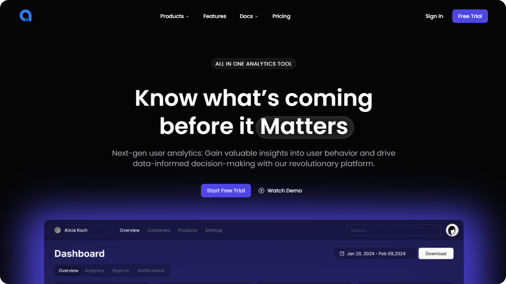

# Analytica

A sleek and modern landing page for a SaaS analytics tool, designed to make a lasting first impression.

> 🚀 Live Preview: [analytica01.vercel.app](https://analytica01.vercel.app/)

---

## ✨ Overview

Analytica is a **frontend-only**, fully responsive landing page built with:

- **React** (TypeScript)
- **Tailwind CSS**
- **Motion** for smooth animations

It offers a clean, professional interface for analytics-focused SaaS platforms, with a design that adapts beautifully across devices.

---

## 📸 Preview

  
  
<!-- Replace with actual screenshot filename or upload to the repo -->

---

## 🛠 Tech Stack

- **React + TypeScript**
- **Tailwind CSS**
- **Motion**

---

## 📁 Project Setup

```bash
# Clone the repository
git clone https://github.com/dhyanptl/Analytica.git

# Navigate to the project folder
cd Analytica

# Install dependencies
npm install

# Start development server
npm run dev


